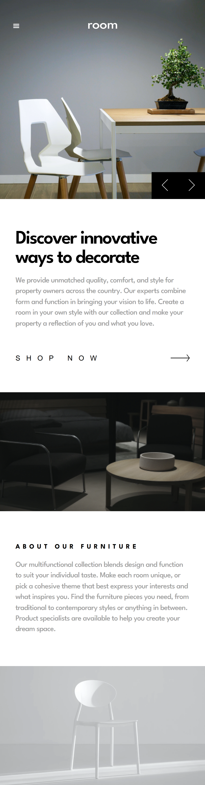
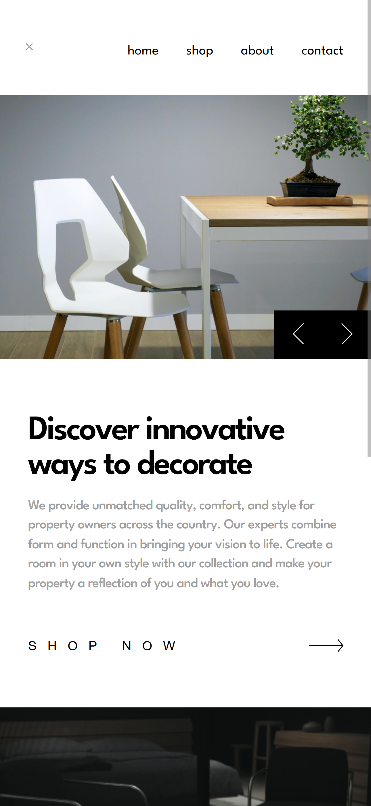
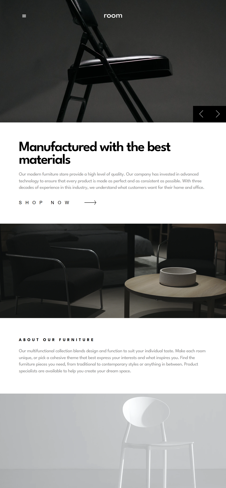

# Room Homepage

Esta é uma solução para o desafio [Room homepage](https://www.frontendmentor.io/challenges/room-homepage-B8vQn5MnZ) do Frontend Mentor.


## 📋 Sobre o Projeto

Este projeto consiste em uma Landing Page para uma loja de móveis com um slider de navegação entre diferentes seções de produtos. O foco principal foi a fidelidade ao layout proposto e a responsividade.

### Desktop
<div align="center">
  
</div>

<br>

### Mobile & Tablet
| Mobile | Menu Mobile | Tablet |
|:---:|:---:|:---:|
|  |  |  |
### 🚀 Tecnologias Utilizadas

- **React** (Estrutura e Lógica de Componentes)
- **Vite** (Build Tool rápida e otimizada)
- **CSS / Sass** (Adapte aqui conforme o que você usou: SASS, Tailwind, Modules, etc.)
- **JavaScript** (Lógica de navegação do slider)

### ✨ Funcionalidades

- Layout responsivo adaptável para Mobile, Tablet/Ipads e Desktop (incluindo telas grandes 1440px/1920px).
- Slider funcional para troca de conteúdo (Imagem, Título e Descrição).
- Menu de navegação (Hambúrguer) para dispositivos móveis.

## 🔧 Como rodar o projeto localmente

1. Clone o repositório:
   ```bash
   git clone [https://github.com/avivianedev/room-home.git)

2. Entre na pasta do projeto:
    cd room-hompege

3. Instale as dependências:
    npm install

4. Rode o servidor de desenvolvimento:
    npm run dev

👩‍💻 Autora
Viviane - Github[https://github.com/avivianedev]